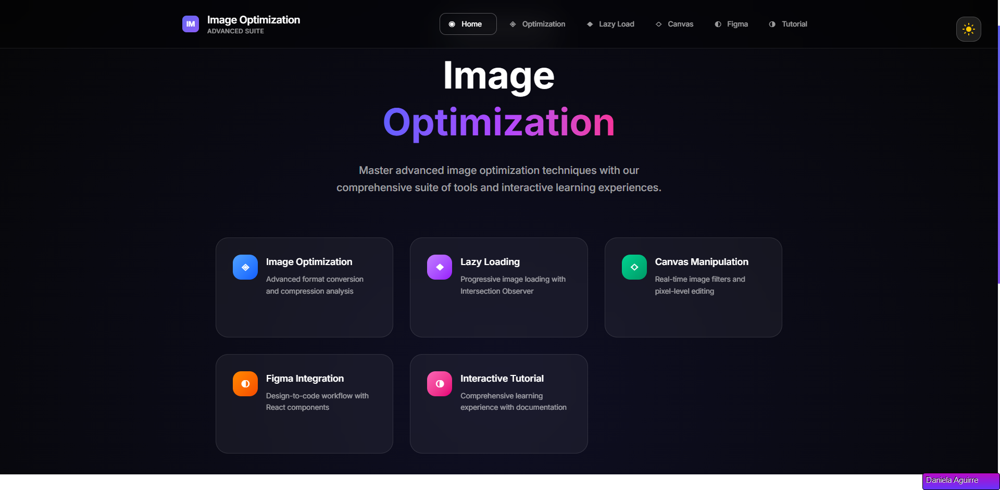
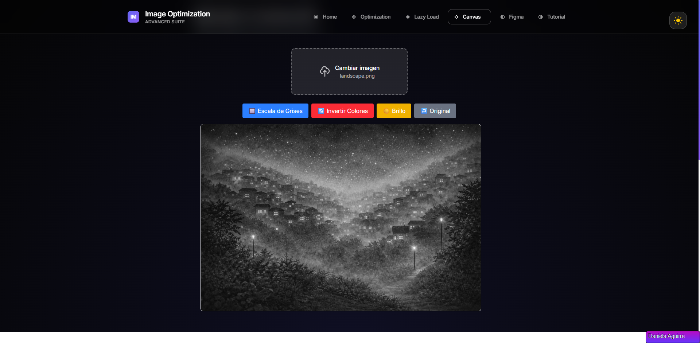
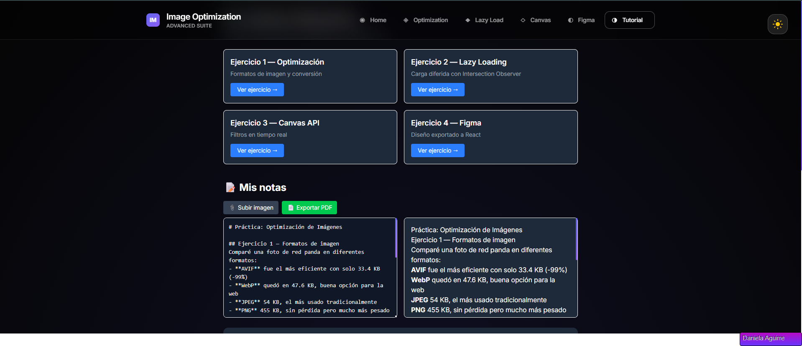

# 🎨 Image Optimization Suite

<div align="center">


**Advanced Image Processing & Optimization Tools with Modern Web Technologies**

[](https://react.dev/)
[](https://typescriptlang.org/)
[](https://tailwindcss.com/)
[](https://vitejs.dev/)


</div>

---

## 🚀 Overview

The **Image Optimization Suite** is a comprehensive web application that provides advanced image processing capabilities, educational content, and interactive tools for developers and designers. Built with cutting-edge technologies, it offers real-time image optimization, lazy loading implementations, canvas-based filters, and Figma integration.

### ✨ Key Features

- 🖼️ **Smart Image Optimization** - Automatic compression and format conversion
- 🎛️ **Real-time Canvas Filters** - Apply filters instantly with Canvas API
- 🔄 **Lazy Loading System** - Performance-optimized image loading
- 🎨 **Figma Integration** - Seamless design workflow integration  
- 🌓 **Dark/Light Themes** - Beautiful theme switching with smooth transitions
- 📚 **Interactive Tutorials** - Learn optimization techniques step-by-step
- 📱 **Responsive Design** - Perfect experience across all devices
- ⚡ **Premium Performance** - Built on React 19 and Vite for lightning speed

---

## 🛠️ Tech Stack

### Frontend
- **React 19** - Latest React with concurrent features
- **TypeScript** - Type-safe development
- **Tailwind CSS v4** - Modern utility-first styling
- **React Router v7** - Advanced routing capabilities

### Build & Development
- **Vite 7** - Next-generation build tool
- **ESLint** - Code quality and consistency
- **PNPM** - Fast, disk space efficient package manager

### APIs & Libraries
- **Canvas API** - Real-time image processing
- **FileReader API** - File handling and processing
- **React Markdown** - Rich documentation rendering
- **jsPDF** - PDF generation capabilities

---

## 📸 Screenshots

<div align="center">

### 🏠 Home Page


### 🎨 Canvas Editor


### 📚 Tutorial System  


</div>

---

## 🚀 Quick Start

### Prerequisites

- [Node.js](https://nodejs.org/) (v18 or higher)
- [PNPM](https://pnpm.io/) (v8 or higher)

### Installation

```bash
# Clone the repository
git clone https://github.com/RuthDanielaAguirre/-Image-Optimization.git

# Navigate to project directory
cd -Image-Optimization

# Install dependencies
pnpm install

# Start development server
pnpm run dev
```

### Build for Production

```bash
# Create optimized build
pnpm run build

# Preview production build
pnpm run preview
```

---

## 📁 Project Structure

```
optimizacion-imagenes/
├── src/
│   ├── components/          # Reusable UI components
│   │   ├── ImageOptimizer.tsx   # Main optimization component
│   │   ├── ImageEditor.tsx      # Canvas-based editor
│   │   ├── LazyImage.tsx        # Lazy loading implementation
│   │   ├── FigmaComponent.tsx   # Figma integration
│   │   └── ThemeToggle.tsx      # Theme switching
│   ├── Pages/               # Route components
│   │   ├── Home.tsx             # Landing page
│   │   ├── Ejercicio1.tsx       # Image optimization
│   │   ├── Ejercicio2.tsx       # Lazy loading demo
│   │   ├── Ejercicio3.tsx       # Canvas API
│   │   ├── Ejercicio4.tsx       # Figma integration
│   │   └── Ejercicio5.tsx       # Tutorial system
│   ├── tutorial/            # Educational content
│   └── assets/              # Static assets
├── public/                  # Public static files
└── docs/                    # Documentation files
```

---

## 🎯 Features Deep Dive

### 🖼️ Image Optimization
- **Automatic compression** with quality preservation
- **Format conversion** (JPEG, PNG, WebP)
- **Batch processing** capabilities
- **Size reduction metrics** and comparisons

### 🎨 Canvas Image Editor
- **Real-time filters**: Grayscale, Invert, Brightness
- **Interactive controls** with immediate preview
- **Export functionality** in multiple formats
- **Non-destructive editing** workflow

### 🔄 Lazy Loading System
- **Performance optimized** loading strategies
- **Intersection Observer** based implementation
- **Placeholder management** during loading
- **Error handling** and fallbacks

### 🌓 Theme System
- **Smooth transitions** between themes
- **System preference detection**
- **Persistent theme selection**
- **Custom purple gradient** design system

---

## 🤝 Contributing

We welcome contributions! Please see our [Contributing Guide](CONTRIBUTING.md) for details.

### Development Workflow

1. **Fork** the repository
2. **Create** a feature branch (`git checkout -b feature/amazing-feature`)
3. **Commit** your changes (`git commit -m 'Add amazing feature'`)
4. **Push** to the branch (`git push origin feature/amazing-feature`)
5. **Open** a Pull Request

---

## 📝 License

This project is licensed under the [MIT License](LICENSE) - see the LICENSE file for details.

---

## 👩‍💻 Author

**Ruth Daniela Aguirre**
- GitHub: [@RuthDanielaAguirre](https://github.com/RuthDanielaAguirre)
- Linkedin: [Ruth Daniela Aguirre](https://www.linkedin.com/in/ruth-daniela-aguirre)

---

## 🙏 Acknowledgments

- [React Team](https://reactjs.org/) for the amazing framework
- [Tailwind Labs](https://tailwindlabs.com/) for the utility-first CSS framework  
- [Vite Team](https://vitejs.dev/) for the lightning-fast build tool
- [TypeScript Team](https://typescriptlang.org/) for type safety

---

<div align="center">

**⭐ If you found this project helpful, please give it a star! ⭐**

Made with ❤️ and lots of ☕

</div>